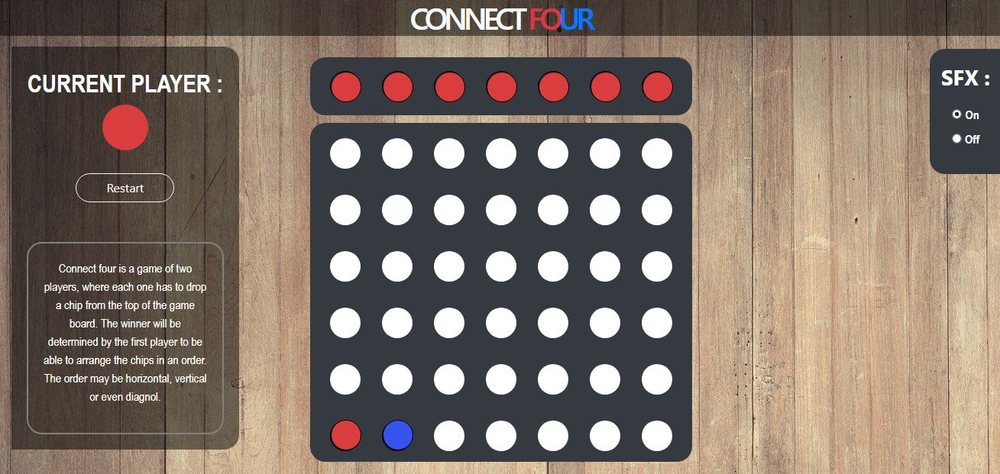

# connect-four-vanilla-js
Connect Four game using Vanilla JS 

Connect-Four is a game where you have two users, each one with a pile of their own respective chips. The gameboard consists of holes through which chips are to be slotted down. The goal is to connect four chips, 

1. In a straight row or
2. In a straight column or 
3. Even diagnolly 

The first player to do so wins. 

### Recursive algorithm for Gravity 
Whenever the chips are slotted down a recursive function is called to check if the chip below has another chip. If it finds one, the program control is returned and the current chip lands above another.

### Changes to be made 
1. The win screen is just an alert message
2. For now it's only avaliable as a 2 player game. AI hasn't been added yet. 

### View
 

